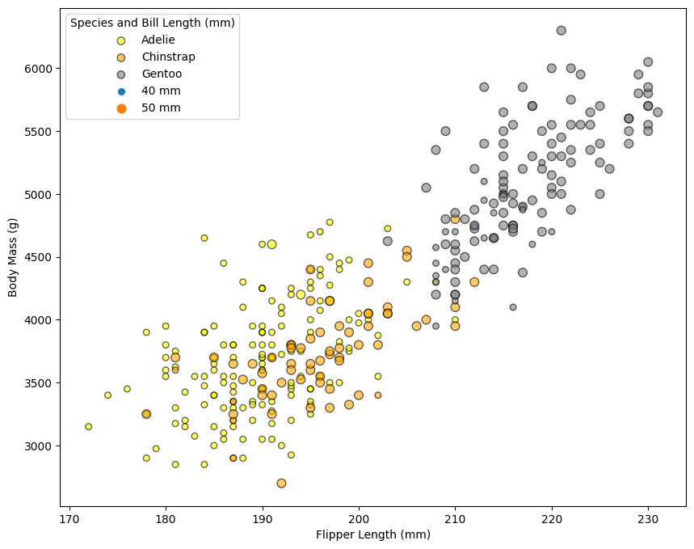

# 02-DataVis-7ways

Assignment 2 - Data Visualization, 7 Ways  
===
# d3
For this visualization, I used the D3.js library to create an interactive scatter plot. To parse the file, i used the d3.csv function and filtered out the datapoints with na values. I was able to achieve all the features in our 'goal' graph. An additional feature in this graph was the interactive tool tip.

## Technical Achievements
- **Proved P=NP**: Using a combination of...

# Excel

## Technical Achievements
- **Proved P=NP**: Using a combination of...

### Design Achievements
- **Re-vamped Apple's Design Philosophy**: As demonstrated in my colorscheme...

# Flourish

## Technical Achievements
- **Proved P=NP**: Using a combination of...

### Design Achievements
- **Re-vamped Apple's Design Philosophy**: As demonstrated in my colorscheme...

# Tableau

## Technical Achievements
- **Proved P=NP**: Using a combination of...

### Design Achievements
- **Re-vamped Apple's Design Philosophy**: As demonstrated in my colorscheme...

# Matplotlib

# Seaborn

# Tableau

## Technical Achievements
- **Proved P=NP**: Using a combination of...

### Design Achievements
- **Re-vamped Apple's Design Philosophy**: As demonstrated in my colorscheme...

# Vegalite

# References
https://www.educative.io/answers/how-to-create-a-bubble-chart-using-d3
https://stackoverflow.com/questions/11189284/d3-axis-labeling
